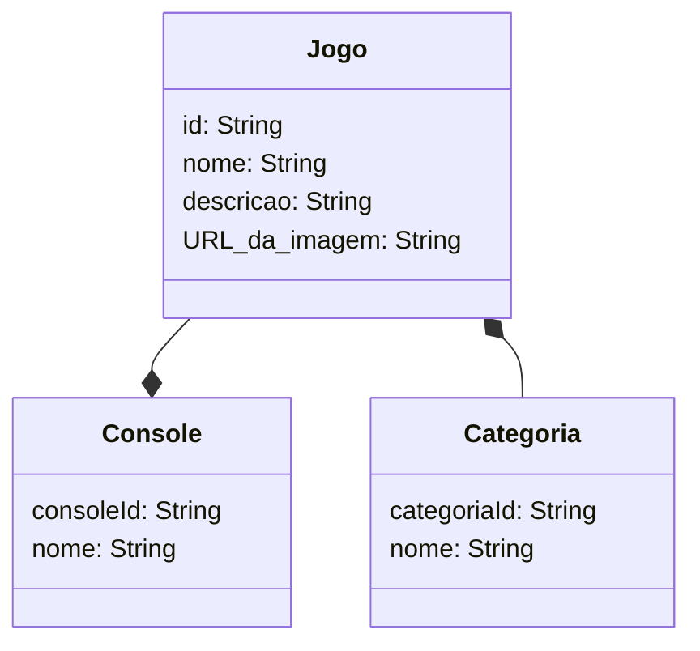

# Decolando-2025
RESTful API desafio decola tech.
## Principais tecnologias
●Java 17: A versão mais recente da linguagem de programação Java, que oferece melhorias de desempenho e novas funcionalidades.

●Spring Boot 3: Um framework que facilita a criação de aplicações Java, fornecendo uma configuração padrão e simplificada.

●Spring Data JPA: Um módulo do Spring que simplifica o acesso a dados em bancos de dados relacionais, utilizando a API Java Persistence (JPA).

●MySQL Driver: Um conector JDBC para o banco de dados MySQL, permitindo que a aplicação se comunique com o banco de dados.
Railway: Uma plataforma de hospedagem que facilita o deploy e gerenciamento de aplicações.

## Diagrama

